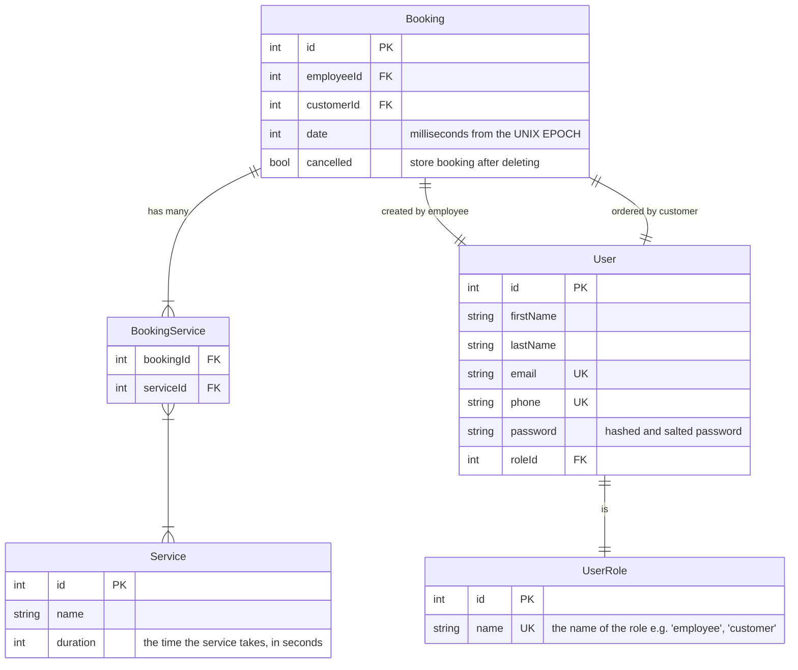

# Entity-relation-model

```mermaid
erDiagram
    User {
        int id PK
        string firstName
        string lastName
        string email UK
        string phone UK
        string password "hashed and salted password"
        int roleId FK
    }
    
    UserRole {
        int id PK
        string name UK "the name of the role e.g. 'employee', 'customer'"
    }
        
    Service {
        int id PK
        string name
        int duration "the time the service takes, in seconds"
    }
   
    Booking {
        int id PK
        int employeeId FK
        int customerId FK
        int date "milliseconds from the UNIX EPOCH"
        bool cancelled "store booking after deleting"
    }
    
    BookingService {
        int bookingId FK
        int serviceId FK
    }

    Booking ||--|{ BookingService : "has many"
    BookingService }|--|{ Service : ""
    Booking ||--|| User : "created by employee"
    Booking ||--|| User : "ordered by customer"
    User ||--|| UserRole : "is"
```
