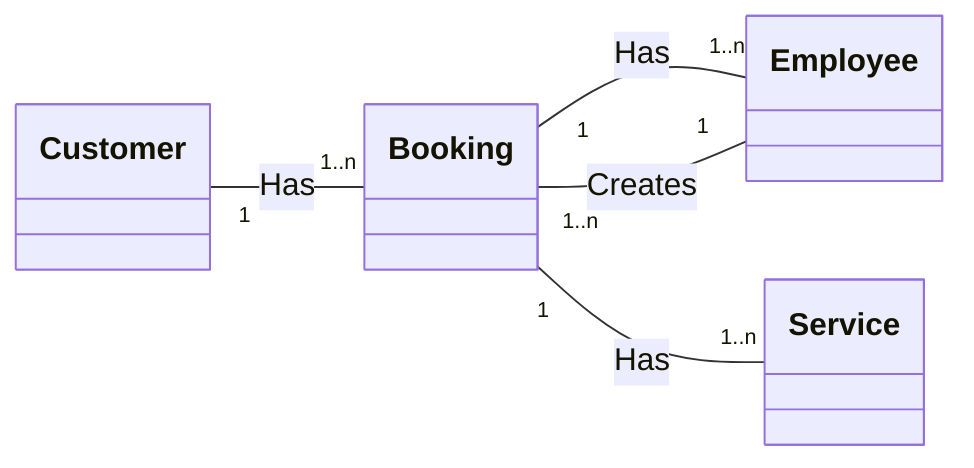

# Domain model

```mermaid
classDiagram 
direction LR
        
class Customer {
    
}

class Employee {
        
}

class Booking {
        
}

class Service {
        
}

Customer "1" -- "1..n" Booking : Has
Employee "1" -- "1..n" Booking : Creates
Booking "1" -- "1..n" Employee : Has 
Booking "1" -- "1..n" Service : Has
```

