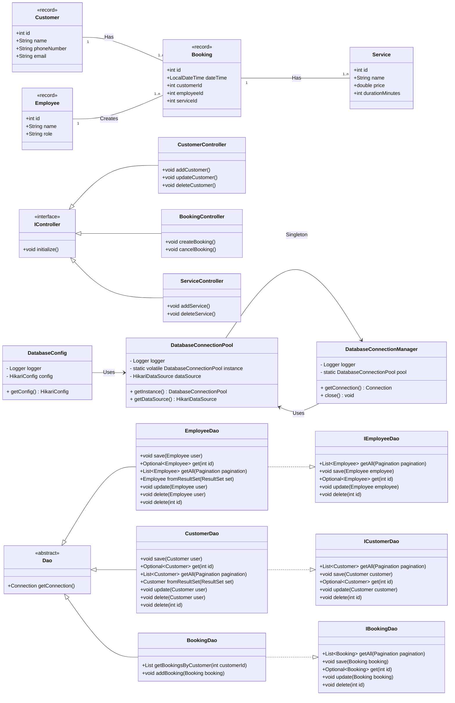

```mermaid
classDiagram
direction LR

    class Customer {
        <<record>>
        +int id
        +String name
        +String phoneNumber
        +String email
    }

    class Employee {
        <<record>>
        +int id
        +String name
        +String role
    }

    class Booking {
        <<record>>
        +int id
        +LocalDateTime dateTime
        +int customerId
        +int employeeId
        +int serviceId
    }

    class Service {
        +int id
        +String name
        +double price
        +int durationMinutes
    }

    class IController {
        <<interface>>
        +void initialize()
    }

    class CustomerController {
        +void addCustomer()
        +void updateCustomer()
        +void deleteCustomer()
    }

    class BookingController {
        +void createBooking()
        +void cancelBooking()
    }

    class ServiceController {
        +void addService()
        +void deleteService()
    }

    
    class DatabaseConfig {
        - Logger logger
        - HikariConfig config
        + getConfig() HikariConfig
    }

    class DatabaseConnectionPool {
        - Logger logger
        - static volatile DatabaseConnectionPool instance
        - HikariDataSource dataSource
        + getInstance() DatabaseConnectionPool
        + getDataSource() HikariDataSource
    }

    class DatabaseConnectionManager {
        - Logger logger
        - static DatabaseConnectionPool pool
        + getConnection() Connection
        + close() void
    }
    
    class Dao {
        <<abstract>>
        +Connection getConnection()
    }

    class CustomerDao {
        +void save(Customer user)
        +Optional~Customer~ get(int id)
        +List~Customer~ getAll(Pagination pagination)
        +Customer fromResultSet(ResultSet set)
        +void update(Customer user)
        +void delete(Customer user)
        +void delete(int id)
    }

    class EmployeeDao {
        +void save(Employee user)
        +Optional~Employee~ get(int id)
        +List~Employee~ getAll(Pagination pagination)
        +Employee fromResultSet(ResultSet set)
        +void update(Employee user)
        +void delete(Employee user)
        +void delete(int id)
    }
    class ICustomerDao {
        +List~Customer~ getAll(Pagination pagination)
        +void save(Customer customer)
        +Optional~Customer~ get(int id)
        +void update(Customer customer)
        +void delete(int id)
    }
    
    class IEmployeeDao {
        +List~Employee~ getAll(Pagination pagination)
        +void save(Employee employee)
        +Optional~Employee~ get(int id)
        +void update(Employee employee)
        +void delete(int id)
    }
    

    class BookingDao {
        +List<Booking> getBookingsByCustomer(int customerId)
        +void addBooking(Booking booking)
    }

    class IBookingDao {
        +List~Booking~ getAll(Pagination pagination)
        +void save(Booking booking)
        +Optional~Booking~ get(int id)
        +void update(Booking booking)
        +void delete(int id)
    }

    Customer "1" -- "1..n" Booking : Has
    Employee "1" -- "1..n" Booking : Creates
    Booking "1" -- "1..n" Service : Has
    IController <|-- CustomerController
    IController <|-- BookingController
    IController <|-- ServiceController
    DatabaseConfig --> DatabaseConnectionPool : Uses
    DatabaseConnectionPool --> DatabaseConnectionManager : Singleton
    DatabaseConnectionManager --> DatabaseConnectionPool : Uses
    Dao <|-- EmployeeDao
    Dao <|-- CustomerDao
    EmployeeDao ..|> IEmployeeDao
    CustomerDao ..|> ICustomerDao
    Dao <|-- BookingDao
    BookingDao ..|>IBookingDao
    

```