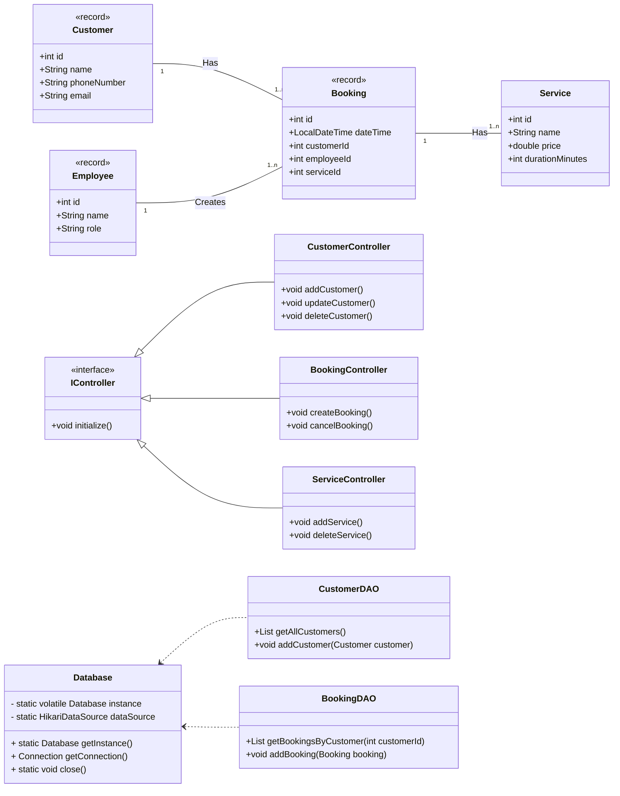

```mermaid
classDiagram
direction LR

    class Customer {
        <<record>>
        +int id
        +String name
        +String phoneNumber
        +String email
    }

    class Employee {
        <<record>>
        +int id
        +String name
        +String role
    }

    class Booking {
        <<record>>
        +int id
        +LocalDateTime dateTime
        +int customerId
        +int employeeId
        +int serviceId
    }

    class Service {
        +int id
        +String name
        +double price
        +int durationMinutes
    }

    class IController {
        <<interface>>
        +void initialize()
    }

    class CustomerController {
        +void addCustomer()
        +void updateCustomer()
        +void deleteCustomer()
    }

    class BookingController {
        +void createBooking()
        +void cancelBooking()
    }

    class ServiceController {
        +void addService()
        +void deleteService()
    }

    class Database {
        - static volatile Database instance
        - static HikariDataSource dataSource
        + static Database getInstance()
        + Connection getConnection()
        + static void close()
    }

    class CustomerDAO {
        +List<Customer> getAllCustomers()
        +void addCustomer(Customer customer)
    }

    class BookingDAO {
        +List<Booking> getBookingsByCustomer(int customerId)
        +void addBooking(Booking booking)
    }

    Customer "1" -- "1..n" Booking : Has
    Employee "1" -- "1..n" Booking : Creates
    Booking "1" -- "1..n" Service : Has
    IController <|-- CustomerController
    IController <|-- BookingController
    IController <|-- ServiceController
    Database <.. CustomerDAO
    Database <.. BookingDAO

```