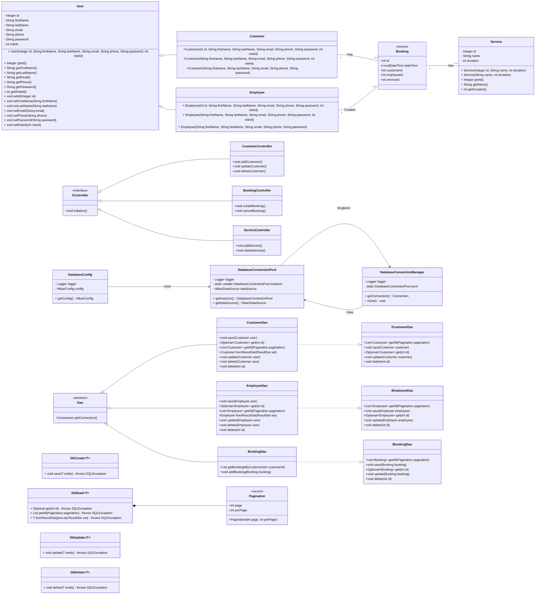

```mermaid
classDiagram
direction LR
    class User {
        - Integer id
        - String firstName
        - String lastName
        - String email
        - String phone
        - String password
        - int roleId

        + User(Integer id, String firstName, String lastName, String email, String phone, String password, int roleId)

        + Integer getId()
        + String getFirstName()
        + String getLastName()
        + String getEmail()
        + String getPhone()
        + String getPassword()
        + int getRoleId()

        + void setId(Integer id)
        + void setFirstName(String firstName)
        + void setLastName(String lastName)
        + void setEmail(String email)
        + void setPhone(String phone)
        + void setPassword(String password)
        + void setRoleId(int roleId)
    }
    class Customer {
        +Customer(int id, String firstname, String lastName, String email, String phone, String password, int roleId)
        +Customer(String firstname, String lastName, String email, String phone, String password, int roleId)
        +Customer(String firstname, String lastName, String email, String phone, String password)
    }

    class Employee {
        + Employee(int id, String firstName, String lastName, String email, String phone, String password, int roleId)
        + Employee(String firstName, String lastName, String email, String phone, String password, int roleId)
        + Employee(String firstName, String lastName, String email, String phone, String password)
    }

    class Booking {
        <<record>>
        +int id
        +LocalDateTime dateTime
        +int customerId
        +int employeeId
        +int serviceId
    }

    class Service {
        - Integer id
        - String name
        - int duration

        + Service(Integer id, String name, int duration)
        + Service(String name, int duration)

        + Integer getId()
        + String getName()
        + int getDuration()
    }

    class IController {
        <<interface>>
        +void initialize()
    }

    class CustomerController {
        +void addCustomer()
        +void updateCustomer()
        +void deleteCustomer()
    }

    class BookingController {
        +void createBooking()
        +void cancelBooking()
    }

    class ServiceController {
        +void addService()
        +void deleteService()
    }

    
    class DatabaseConfig {
        - Logger logger
        - HikariConfig config
        + getConfig() HikariConfig
    }

    class DatabaseConnectionPool {
        - Logger logger
        - static volatile DatabaseConnectionPool instance
        - HikariDataSource dataSource
        + getInstance() DatabaseConnectionPool
        + getDataSource() HikariDataSource
    }

    class DatabaseConnectionManager {
        - Logger logger
        - static DatabaseConnectionPool pool
        + getConnection() Connection
        + close() void
    }
    
    class Dao {
        <<abstract>>
        +Connection getConnection()
    }

    class CustomerDao {
        +void save(Customer user)
        +Optional~Customer~ get(int id)
        +List~Customer~ getAll(Pagination pagination)
        +Customer fromResultSet(ResultSet set)
        +void update(Customer user)
        +void delete(Customer user)
        +void delete(int id)
    }

    class EmployeeDao {
        +void save(Employee user)
        +Optional~Employee~ get(int id)
        +List~Employee~ getAll(Pagination pagination)
        +Employee fromResultSet(ResultSet set)
        +void update(Employee user)
        +void delete(Employee user)
        +void delete(int id)
    }
    class ICustomerDao {
        +List~Customer~ getAll(Pagination pagination)
        +void save(Customer customer)
        +Optional~Customer~ get(int id)
        +void update(Customer customer)
        +void delete(int id)
    }
    
    class IEmployeeDao {
        +List~Employee~ getAll(Pagination pagination)
        +void save(Employee employee)
        +Optional~Employee~ get(int id)
        +void update(Employee employee)
        +void delete(int id)
    }
    

    class BookingDao {
        +List<Booking> getBookingsByCustomer(int customerId)
        +void addBooking(Booking booking)
    }

    class IBookingDao {
        +List~Booking~ getAll(Pagination pagination)
        +void save(Booking booking)
        +Optional~Booking~ get(int id)
        +void update(Booking booking)
        +void delete(int id)
    }
    
    class DbCreate~T~ {
        + void save(T entity) throws SQLException
    }

    class DbRead~T~ {
        + Optional<T> get(int id) throws SQLException
        + List<T> getAll(Pagination pagination) throws SQLException
        + T fromResultSet(java.sql.ResultSet set) throws SQLException
    }

    class DbUpdate~T~ {
        + void update(T entity) throws SQLException
    }

    class DbDelete~T~ {
        + void delete(T entity) throws SQLException
    }

    class Pagination {
        <<record>>
        +int page
        +int perPage
        +Pagination(int page, int perPage)
    }
    Customer "1" -- "1..n" Booking : Has
    Employee "1" -- "1..n" Booking : Creates
    Booking "1" -- "1..n" Service : Has
    IController <|-- CustomerController
    IController <|-- BookingController
    IController <|-- ServiceController
    DatabaseConfig --> DatabaseConnectionPool : Uses
    DatabaseConnectionPool --> DatabaseConnectionManager : Singleton
    DatabaseConnectionManager --> DatabaseConnectionPool : Uses
    Dao <|-- EmployeeDao
    Dao <|-- CustomerDao
    EmployeeDao ..|> IEmployeeDao
    CustomerDao ..|> ICustomerDao
    Dao <|-- BookingDao
    BookingDao ..|>IBookingDao
    User <|-- Customer
    User <|-- Employee
    DbRead *-- Pagination
    
```