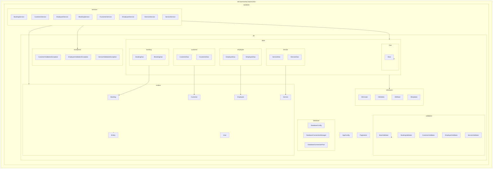

# Pakke diagram

```mermaid
graph TD
    subgraph dk.haarmonika.haarmonika
        subgraph backend
            subgraph db
                subgraph daos
                    subgraph booking
                        BookingDao
                        IBookingDao
                    end
                    subgraph customer
                        CustomerDao
                        ICustomerDao
                    end
                    subgraph employee
                        EmployeeDao
                        IEmployeeDao
                    end
                    subgraph service
                        ServiceDao
                        IServiceDao
                    end
                    subgraph Dao
                        IDao
                    end
                end
                subgraph database
                    DatabaseConfig
                    DatabaseConnectionManager
                    DatabaseConnectionPool
                end
                subgraph entities
                    Booking
                    Customer
                    Employee
                    IEntity
                    Service
                    User
                end
                subgraph interfaces
                    DbCreate
                    DbDelete
                    DbRead
                    DbUpdate
                end
                subgraph validation
                    BaseValidator
                    BookingValidator
                    CustomerValidator
                    EmployeeValidator
                    ServiceValidator
                end
                AppConfig
                Pagination
                subgraph exceptions
                    CustomerValidationException
                    EmployeeValidationException
                    ServiceValidationException
                end
            end
            subgraph services
                BookingService
                CustomerService
                EmployeeService
                IBookingService
                ICustomerService
                IEmployeeService
                IServiceService
                ServiceService
            end
        end
    end

    booking --> Booking
    customer --> Customer
    employee --> Employee
    service --> Service

    daos --> IDao
    daos --> interfaces

    entities --> IEntity

    validation --> BaseValidator

    services --> exceptions
    services --> daos
    services --> entities
```

