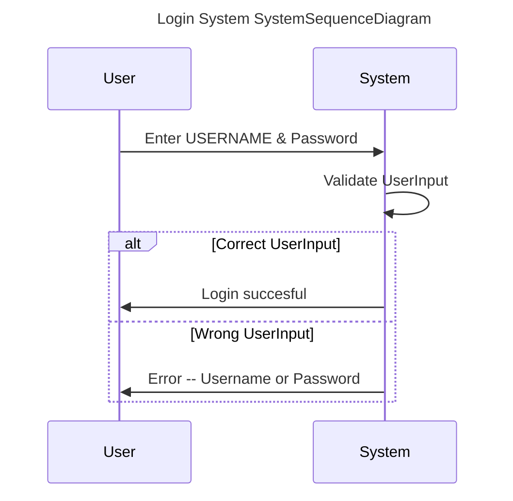
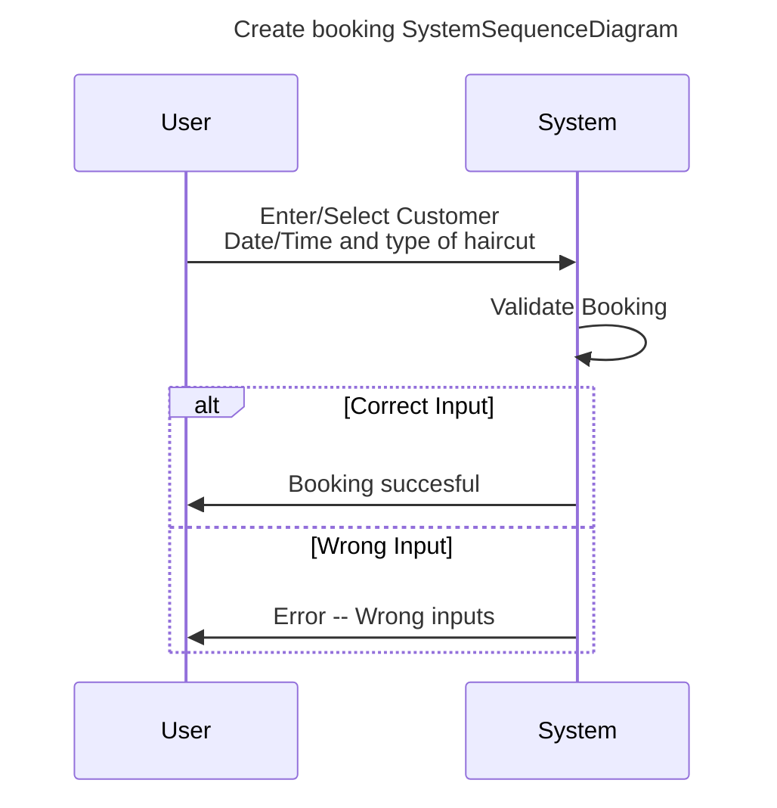
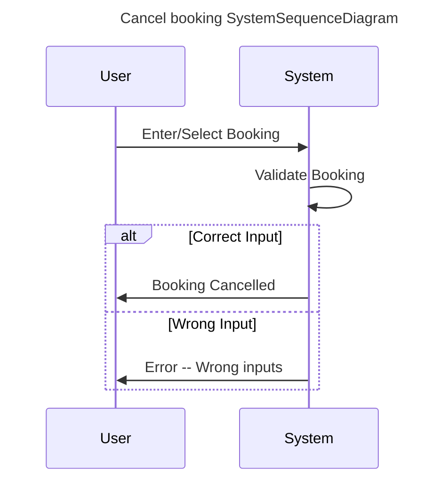
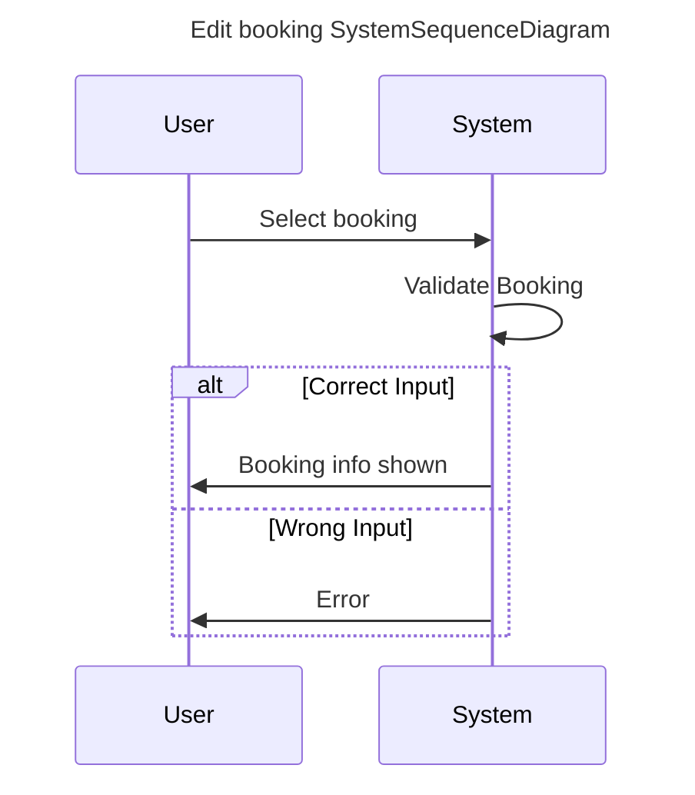

# Diagram

# USE CASE - Login system

###### Precondition:
En medarbejder ønsker at kunne logge ind til arbejdssystemet for
at tilgå sin kalendar.

Når medarbejderen kommer på arbejde vil vedkommende kunne logge ind
på systemet. Der bliver tjekket for korrekt username og password

###### Postcondition:
Medarbejderen har mulighed for at logge ind på systemet for at få sin kalender,
så de kan holde øje med dagen/ugen og månedens kalender.

# USE CASE - Create booking

###### Precondition:
En medarbejder ønsker at lave en booking til en kunde.

Medarbejderen vælger dato, tidspunkt og type af service, samt
indtaster kundeinformationer (navn, telefon nr eller e-mail)

###### Postcondition:
Medarbejden kan lave en booking til en kunde ud fra den givne
medarbejder, med kundens informationer og et tidspunkt/dato.

# USE CASE - Cancel booking

###### Precondition:
En medarbejder ønsker at aflyse en booking til en kunde.

Medarbejderen vælger bookingen fra en liste af bookings der passer
til kundens informationer.

###### Postcondition:

