# Diagram

# USE CASE - Login system

###### Precondition:
En medarbejder ønsker at kunne logge ind til arbejdssystemet for
at tilgå sin kalendar.

Når medarbejderen kommer på arbejde vil vedkommende kunne logge ind
på systemet. Der bliver tjekket for korrekt username og password

###### Postcondition:
Medarbejderen har mulighed for at logge ind på systemet for at få sin kalender,
så de kan holde øje med dagen/ugen og månedens kalender.

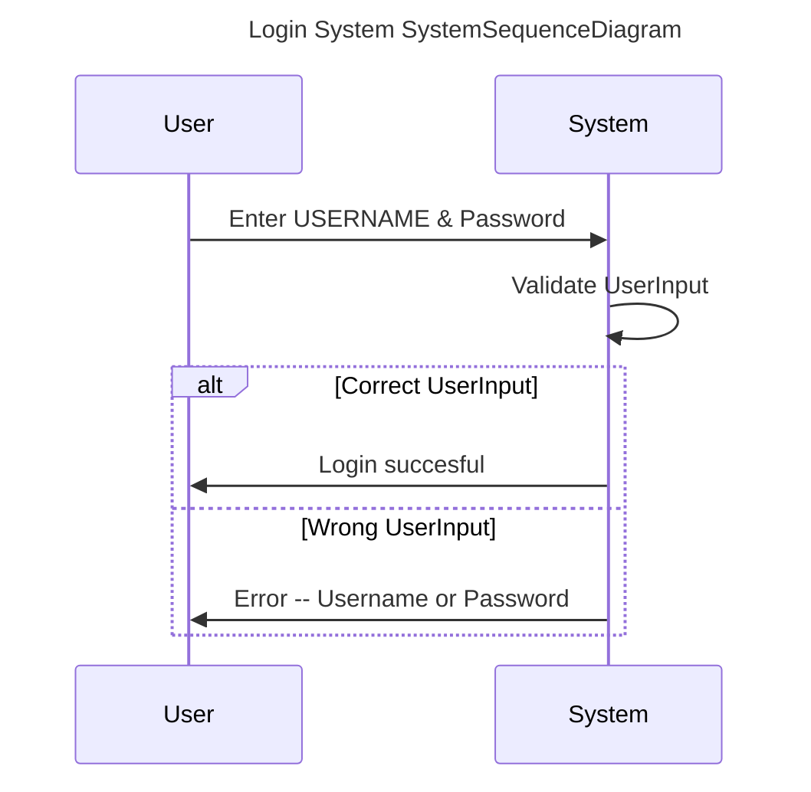

# USE CASE - Create booking

###### Precondition:
En medarbejder ønsker at lave en booking til en kunde.

Medarbejderen vælger dato, tidspunkt og type af service, samt
indtaster kundeinformationer (navn, telefon nr eller e-mail)

###### Postcondition:
Medarbejden kan lave en booking til en kunde ud fra den givne
medarbejder, med kundens informationer og et tidspunkt/dato.

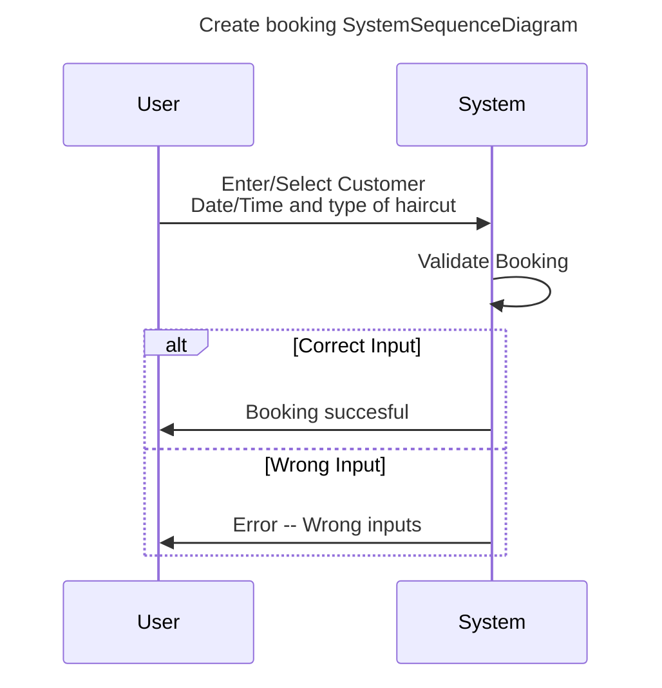
# USE CASE - Cancel booking

###### Precondition:
En medarbejder ønsker at aflyse en booking til en kunde.

Medarbejderen vælger bookingen fra en liste af bookings der passer
til kundens informationer.

###### Postcondition:
Medarbejderen kan vælge en booking og aflyse den, så den stadig ligger i systemet,
og åbner op for en anden kunde at booke den tid.

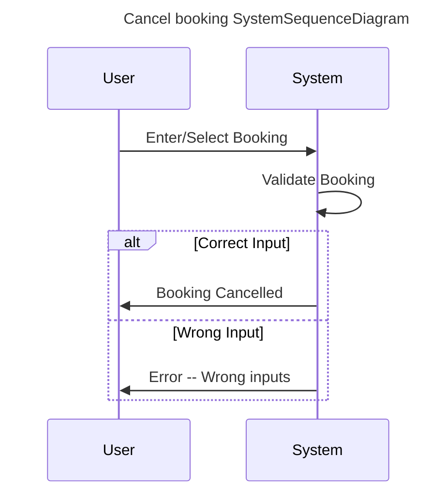

# USE CASE - Edit booking

###### Precondition:
En medarbejder ønsker at redigere i en booking.

Medarbejderen vælger bookingen fra en liste af bookings der passer
til kundens informationer.

###### Postcondition:
Medarbejderen kan vælge en booking og redigere den, såsom tidspunkt,
kunde og type af service.

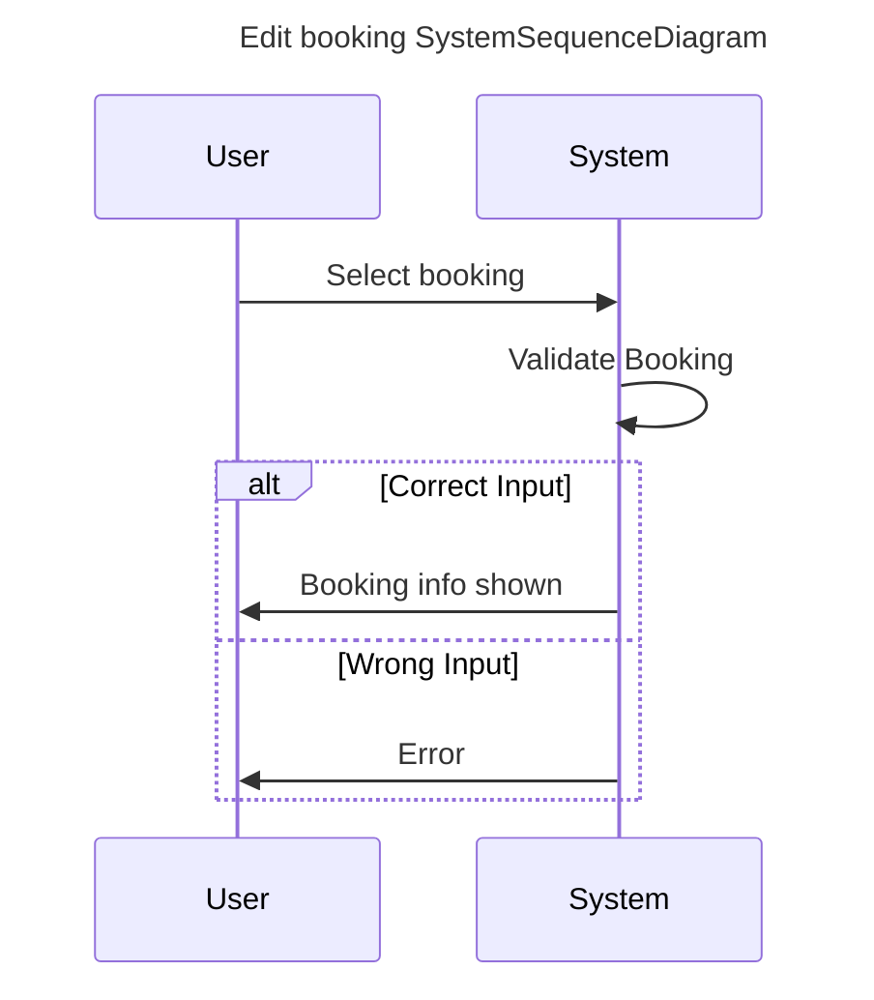
# USE CASE - Visning af bookings (Se dagsskema/ugeplan)
##### Precondition:
En medarbejder ønsker at se sine bookinger for en given dag eller uge.
Systemet skal kunne præsentere en oversigt over bookinger med relevante detaljer.

##### Postcondition:
Medarbejderen har nu adgang til en oversigt over dagens/ugens bookinger og kan planlægge arbejdet bedre.

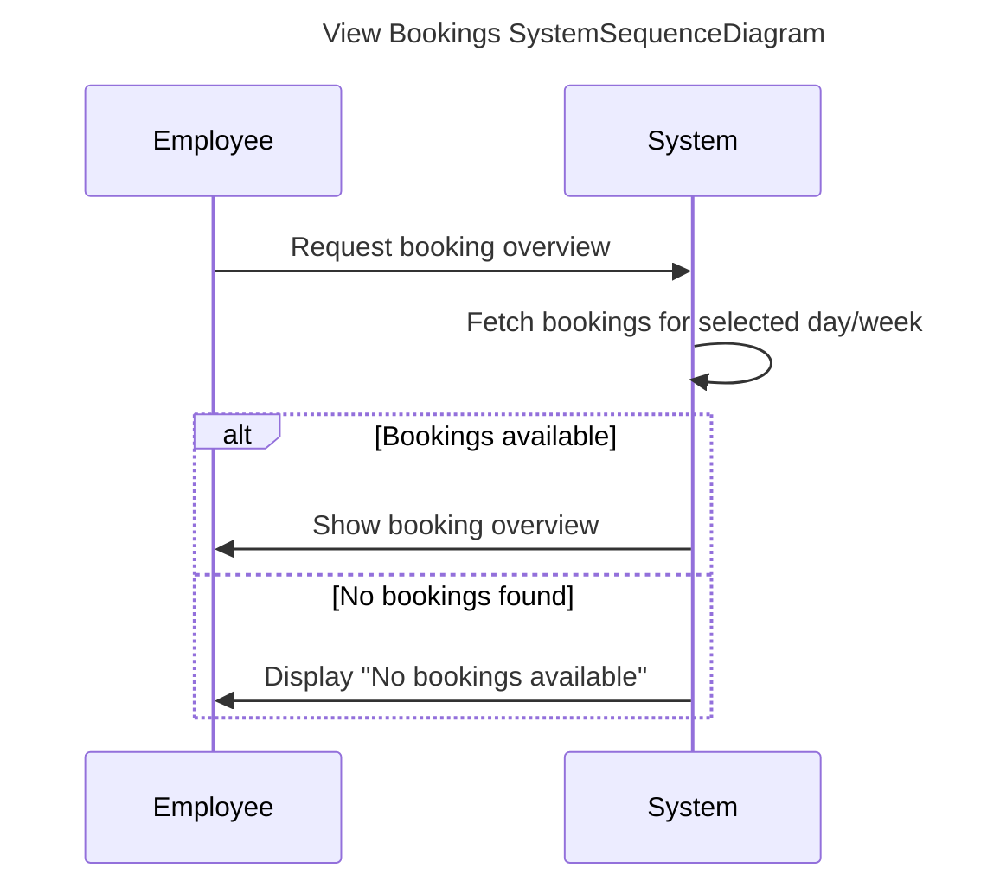
# USE CASE - Håndtering af konflikter i booking
##### Precondition:
En medarbejder eller administrator forsøger at oprette
en ny tidsbestilling.
Systemet skal sikre, at ingen medarbejder 
har to samtidige bookinger.

##### Postcondition:
Hvis der er en konflikt, får brugeren en fejlmeddelelse og skal vælge et nyt tidspunkt.
Hvis der ikke er en konflikt, bliver bookingen oprettet korrekt.

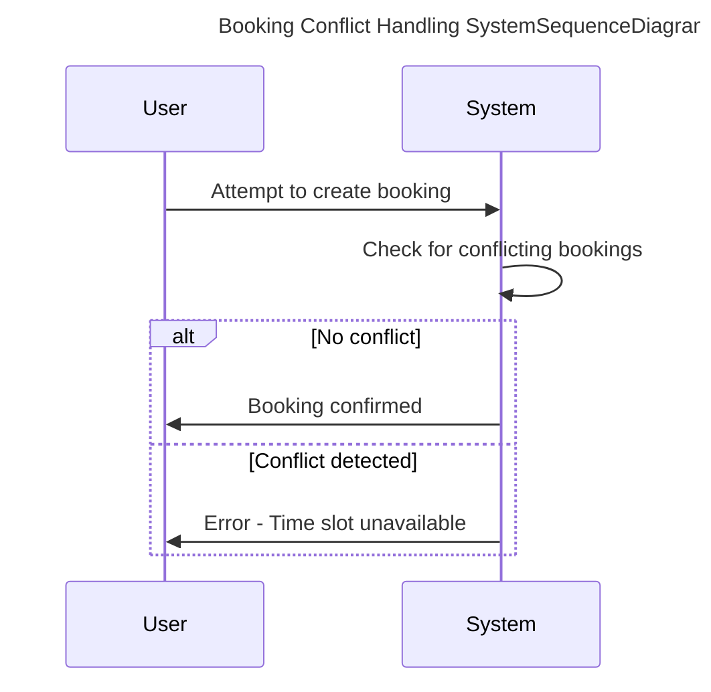

# USE CASE - Administratorfunktioner
##### Precondition:
Monika ønsker at administrere medarbejdere og bookinger i systemet.

#### Postcondition:
Monika har adgang til at tilføje/slette medarbejdere og administrere bookinger.

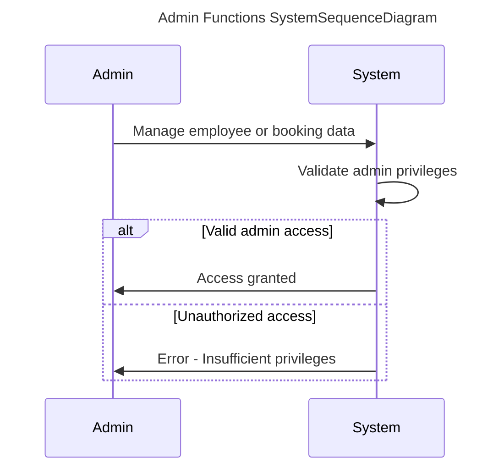

# USE CASE - Notifikationer til kunder
##### Precondition:
En booking er oprettet, ændret eller aflyst, og kunden skal informeres via e-mail eller SMS.

##### Postcondition:
Kunden har modtaget en besked om deres bookingstatus.

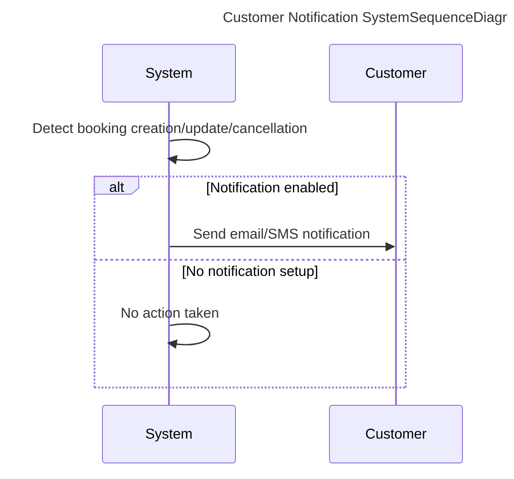
# USE CASE - Kunderegister
##### Precondition:
En medarbejder ønsker at gemme eller opdatere oplysninger om en kunde.

##### Postcondition:
Kunden er nu registreret i systemet med navn, kontaktoplysninger og eventuel bookinghistorik.

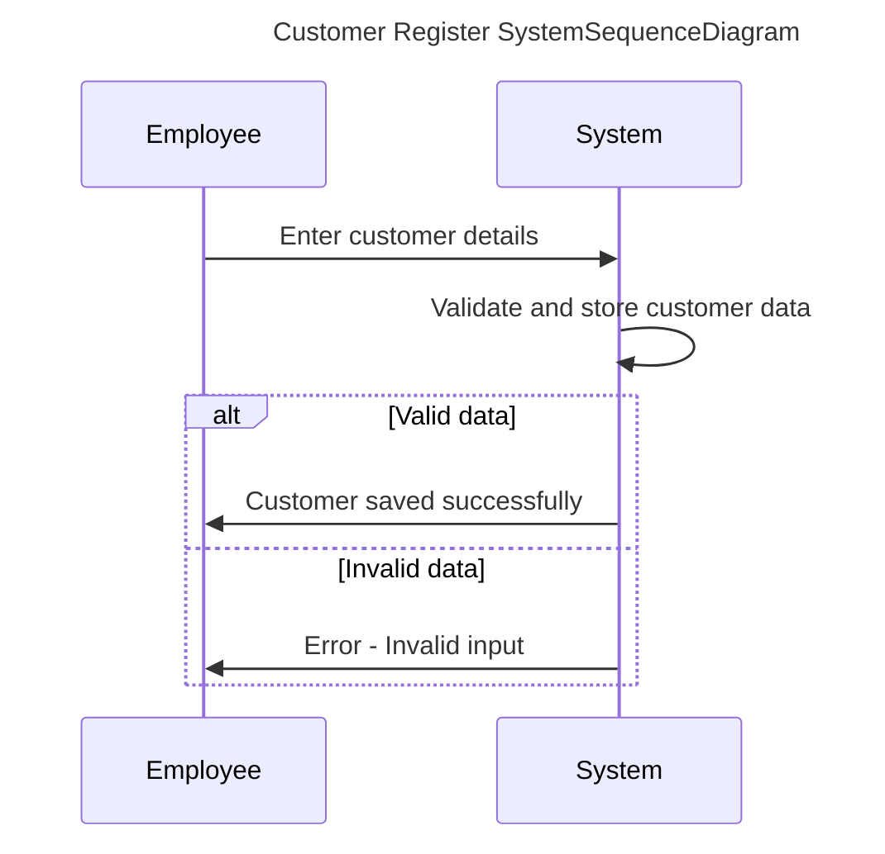

# USE CASE - Automatisk sletning af gamle bookinger
##### Precondition:
Der findes bookinger i systemet, der er ældre end 5 år.

##### Postcondition:
Systemet har automatisk slettet gamle bookinger med et fast interval (f.eks. en gang om måneden).

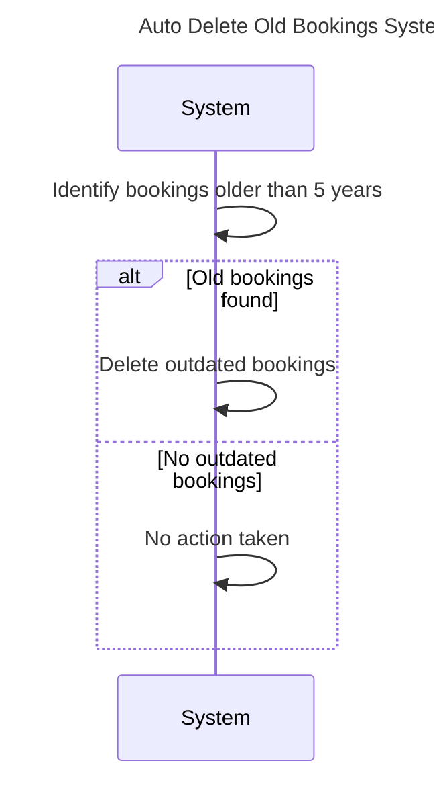

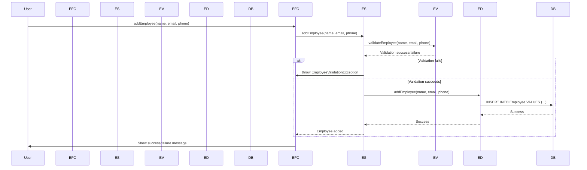

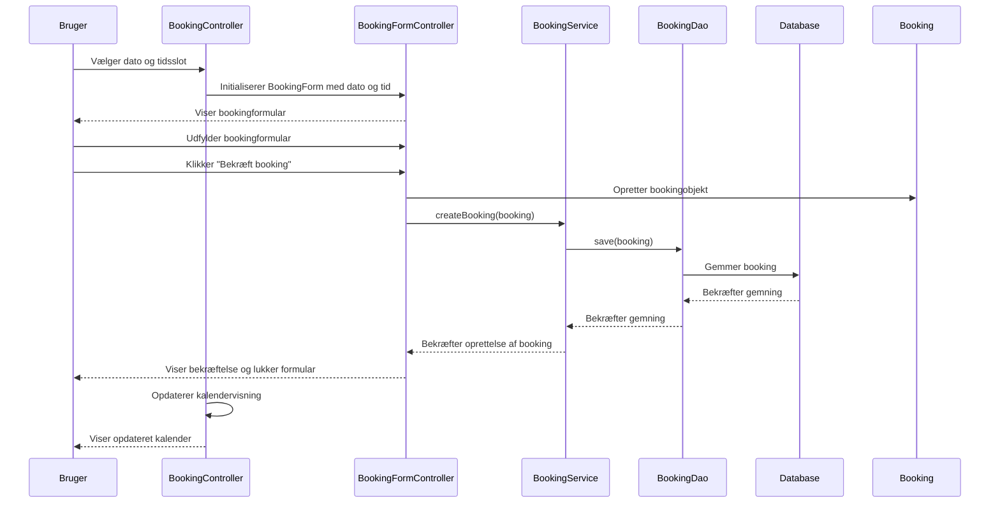
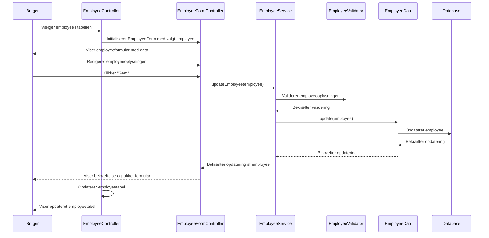
